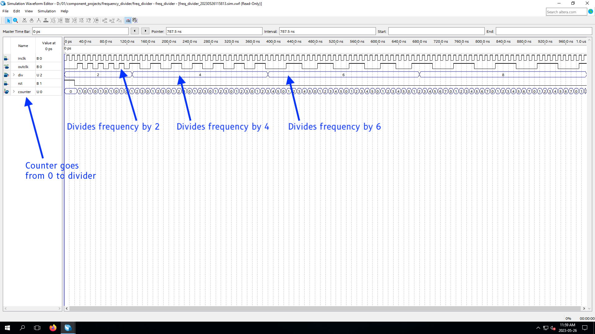
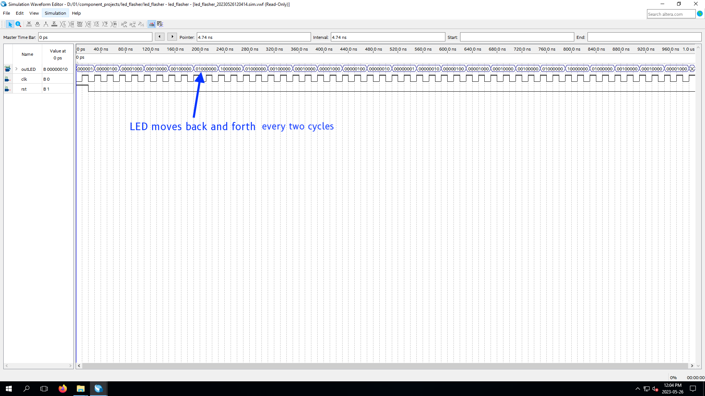
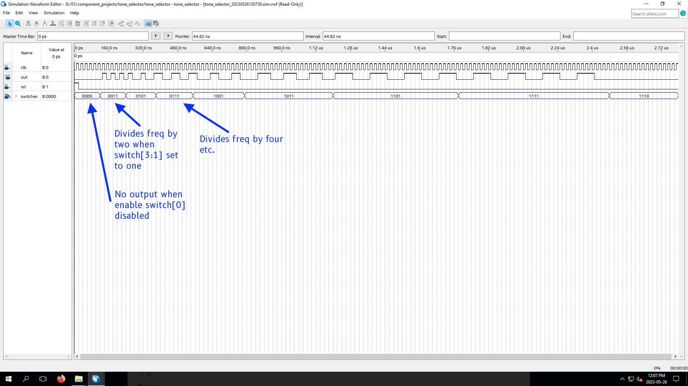
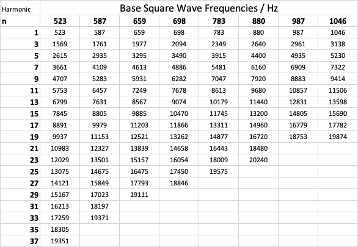

# Something about the CPEN 311 Lab 1
## SOF directory path
[Basic_Organ_Solution.sof](./rtl/Basic_Organ_Solution.sof)
./rtl/Basic_Organ_Solution.sof

## Lab status
- [ ] Frequency divider complete - [freq_divider.sv](./rtl/freq_divider.sv)
- [ ] Audio output switch complete - [tone_selector.sv](./rtl/tone_selector.sv)
- [ ] Audio pitch selector switches complete -  [tone_selector.sv](./rtl/tone_selector.sv)
- [ ] Info channel shows note complete - [Basic_Organ_Solution.sv](./rtl/Basic_Organ_Solution.sv)
- [ ] Switch positioning on information console complete - [Basic_Organ_Solution.sv](./rtl/Basic_Organ_Solution.sv)
- [ ] Something interesting on console complete - [Basic_Organ_Solution.sv](./rtl/Basic_Organ_Solution.sv)
- [ ] LED control - complete - [led_flasher.sv](./rtl/led_flasher.sv)

## Annotated simulation / signaltap screenshots

## Information on simulations
All simulations created by quartus simulator.

LED flasher and tone selectors have had their parameters adjusted (change from order of ~100Hz to order of ~20Mhz), because the simulation would take too long. You can see the parameters set in the .sv files to determine the actual period. This is set by a parameter called DIVIDER (or some variant), and for the tone selector, parameters called DO, RE, MI…

The frequency can be obtained by clock frequency / DIVIDER. 

### Simulation for Frequency Divider
[Waveform.vwf](./component_projects/frequency_divider/Waveform.vwf)
./component_projects/frequency_divider/Waveform.vwf

**Actual output**
[freq_divider_20230526211137.sim.vwff](./component_projects/frequency_divider/simulation/qsim/freq_divider_20230526211137.sim.vwf)
./component_projects/frequency_divider/simulation/qsim/freq_divider_20230525180337.sim.vwf

### Simulation for led flasher
[Waveform.vwf](./component_projects/led_flasher/Waveform.vwf)
./component_projects/led_flasher/Waveform.vwf

**Actual Output**
[led_flasher_20230526213046.sim.vwf](./component_projects/led_flasher/simulation/qsim/led_flasher_20230526213046.sim.vwf)
./component_projects/led_flasher/simulation/qsim/led_flasher_20230525191546.sim.vwf

### Simulation for tone selector
[Waveform.vwf](./component_projects/tone_selector/Waveform.vwf)
./component_projects/tone_selector/Waveform.vwf

**Actual output**
[tone_selector_20230526211404.sim.vwf](./component_projects/tone_selector/simulation/qsim/tone_selector_20230526211404.sim.vwf)
./component_projects/tone_selector/simulation/qsim/tone_selector_20230526211404.sim.vwf

### Additional information
None

## Bonus Question
We peform a fourier transformation. 

We recall the fourier series for any periodic function can be written as follows:

Since we know that An and Bn are constants, we will not bother to try and calculate them since the bonus question only asks us to find the xtable of frequencies, and not to come up with a fourier series formula. 

However, these are given below for completeness.

Based on my calculations, not shown here, A0 is 0.5, An is 0, and Bn can be written as $2\pi / n$, where the term only exists when n is an odd integer. 

Returning to the important part at hand, we need to calculate the frequencies. We recall for some periodic function such as $sin(kx)$, the period is given as $2\pi/k$.

Using the equation above, we can see that $k = (2n\pi)/T$ , where $T$ is the period of the square wave. Thus, the periods of the fourier series, can be given as $T/n$.

Recall that $f = 1/T$. Thus, the frequencies of the fourier series can be written as $n / T \Rightarrow nf_{squarewave}$, where n is an odd integer. We limit ourselves to 20KHz.  

Suppose we pick a 523Hz square wave. It is comprised of the following sine waves, in Hz:

523, 1569, 2615, 3661, 4707, 5753, 6799, 7845, 8891, 9937, 10983, 12029, 13075, 14121, 15167, 16213, 17259, 18305, 19351, 20397. 

Similarly, we can calculate this for all our square waves.

